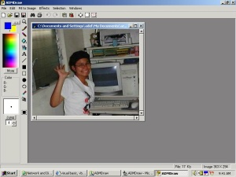



## ADMDraw

### Description

A visual basic gif, jpg, bmp editor... can open an animated gif... please try and vote... thanks! :-)
 
### More Info
 

             |
---                |---
**Submitted On**   |2003-06-18 16:48:04
**By**             |[Adel D\. Mendoza](https://github.com/Planet-Source-Code/PSCIndex/blob/master/ByAuthor/adel-d-mendoza.md)
**Level**          |Beginner
**User Rating**    |4.7 (47 globes from 10 users)
**Compatibility**  |VB 6\.0
**Category**       |[Graphics](https://github.com/Planet-Source-Code/PSCIndex/blob/master/ByCategory/graphics__1-46.md)
**World**          |[Visual Basic](https://github.com/Planet-Source-Code/PSCIndex/blob/master/ByWorld/visual-basic.md)
**Archive File**   |[A\_GIF\_\_JPG1602806182003\.zip](https://github.com/Planet-Source-Code/adel-d-mendoza-admdraw__1-46274/archive/master.zip)

